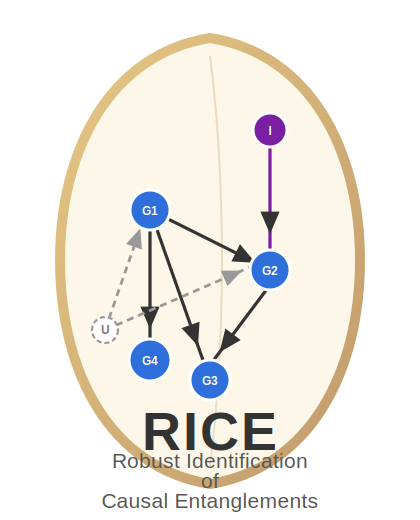

# RICE 

**R**obust **I**dentification of **C**ausal **E**ntanglements

RICE is a framework for identifying causal relationships from perturbation-based single-cell data.

## Quick start

Download or clone this repository to get started:

```bash
git clone https://github.com/HowardGech/RICE.git
cd RICE
```
Alternatively, you can download the repository as a `.zip` file and extract it locally.

## Repository structure

This repository is organized into three main folders:

- `source` — core source code for the RICE model
- `simulation` — synthetic data generation and simulation experiments
- `perturbseq` — analysis of real-world CRISPRi Perturb-seq data

## Source

The `source` folder contains the main implementation of RICE:

- `scRICE_CF.py` — main source code for the RICE model
- `utils.py` — utility functions used throughout the implementation

## Simulation

The `simulation` folder contains scripts for generating synthetic data and running experiments.

- `gen_simulation.py` — generates synthetic datasets  
  It accepts the following arguments, in order:
  1. number of cells to generate
  2. number of genes
  3. number of true causal effects
  4. graph type:
     - `ER` — Erdős–Rényi
     - `SF` — Scale-Free
     - `BP` — Bipartite
  5. intervention type:
     - `soft` - soft intervention
     - `hard` - hard intervention
  6. random seed

- `run_simulation.py` — runs RICE on synthetic data  
  It accepts the same arguments as `gen_simulation.py`.

- `utils_gen.py` — utility functions for synthetic data generation

- `example.ipynb` — example notebook demonstrating how to generate synthetic data, run RICE, and examine performance

## Perturb-seq

The `perturbseq` folder contains code for analyzing real-world CRISPRi datasets.

- `run_Replogle_2022.py` — analyzes causal gene networks in K562 and RPE1 cells using the dataset from [Replogle et al. (2022)](https://www.sciencedirect.com/science/article/pii/S0092867422005979)

The processed Perturb-seq data can be downloaded from [Figshare](https://plus.figshare.com/articles/dataset/_Mapping_information-rich_genotype-phenotype_landscapes_with_genome-scale_Perturb-seq_Replogle_et_al_2022_processed_Perturb-seq_datasets/20029387).